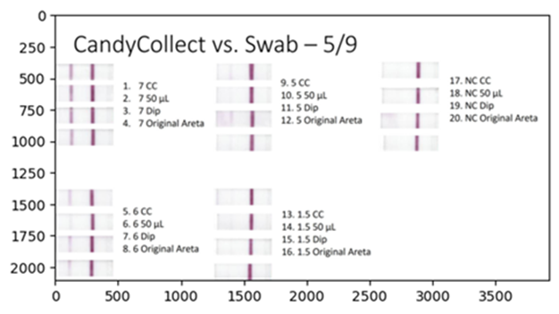

## University of Washington's Candy Collect Project
This repository provides the python scripts made to analyze the scans/images of lateral flow assay strips.

**Affiliations:** Department of Chemistry, University of Washington, Seattle, WA, USA: Bioengineering Department, University of Washington, Seattle, WA, USA: Department of Pediatrics, University of Wisconsin School of Medicine and Public Health, Madison, WI, USA;

**Websites:** [The Theberge Group - Bioanalytical Chemistry for Medicine and the Environment (BCME) Lab](https://depts.washington.edu/bcmelab/)

&nbsp;&nbsp;&nbsp;&nbsp;&nbsp;&nbsp;&nbsp;&nbsp;&nbsp;&nbsp;&nbsp;&nbsp;&nbsp;&nbsp;&nbsp;&nbsp;&nbsp;[Olanrewaju Lab](https://ayokunle.notion.site/main)

## Script Description

The Signal-to-Baseline ratio (SBR) and positivity thresholds are derived using custom image analysis scripts written in Python.   The data pipeline consists four subsections: Data Preparation, Determining the Signal-to-Baseline ratios, Determining Positivity Thresholds, and Final Graphing and Visualization.

**Data Preparation**

The figure below  shows an example of the original data acquired from a flatbed scanner.  The image should be saved using a lossless format such as .tiff file.  If the original image file is saved using a lossy format, such as .jpg, the script converts the image file to the lossless format.  

  

The script performs several operations on this image.  First, it crops the original image of lossless format into multiple images, one for each test strip. Next, it converts the full-color (3D array) image to a monochrome (2D array) image to grayscale. This monochrome image is then inverted. The inverted image array is normalized to the bit-depth of the of the original image.  In our case, the original image was 8-bits per color channels.  Therefore, the inverted image is normalized by dividing the array by 255. The figure below shows the results for each step of this process.

 &nbsp;&nbsp;&nbsp;&nbsp;&nbsp;&nbsp;&nbsp;&nbsp;&nbsp;&nbsp;&nbsp;&nbsp;&nbsp;&nbsp;&nbsp;&nbsp;&nbsp;&nbsp;&nbsp;&nbsp;&nbsp;&nbsp;&nbsp;&nbsp;&nbsp;&nbsp;&nbsp;&nbsp;&nbsp;&nbsp;&nbsp;&nbsp;&nbsp;&nbsp;&nbsp;   

The profile, or rather the normalized digital number (intensity) for each pixel location, is derived from the cropped inverted grayscale image.  Each image contains a number of rows.  An example profile, which is generated by averaging these rows, is shown in the next figure.

  

**Determining Signal-to Baseline Ratios**

The signal-to-baseline ratio (SBR) is calculated in two steps from the profile data.  First, the baseline is determined by averaging the signals collected from two segments located both sides of the test line peak, nominally centered around 20 pixels away from the peak.  Occasionally, test strip membranes have a smeared appearance, which may result in profiles with irregular features along the baseline.  In this case, the precise segment location is manually selected.  Each segment is 5 to 10 pixels wide.  Second, the script identifies the test line peak location and intensity. The SBR is the test line peak intensity divided by the average from the two segments.  This script is used to determine the SBR for each strip.

The figure below represents a typical profile from a test strip exposed to a high bacteria load.  The rectangles identify the locations of the two segments used to calculate the baseline. The resulting baseline is shown as an amber line at an intensity of 0.02.  The test line peak signal intensity is 0.23.  The SBR is therefore 0.23 divided by 0.02.

  

**Determining the Positivity Thresholds**

Each experimental condition was measured three times accompanied with three negative controls.  The positivity thresholds for each condition are based on profiles of these negative controls.

The first step calculates the SBR for the negative controls.  However, a problem arises as the negative controls lack a discernable peak in the test line.  In contrast, positive test strips consistently show both a test line peak and a control line peak separated by approximately 55 pixels.  Consequently, the code identifies a peak signal on the negative controls by specifically interrogating a profile segment 45 to 65 pixels from the control line peak.  The baseline is determined as described in the *Determining Signal-to-Baseline* section.

The next figure  represents a typical profile of a negative control.  The red rectangles mark the locations of the two segments used to calculate the baseline.  In this case, the test line peak signal intensity and baseline are 0.04.  The SBR is 0.04 divided by 0.04.  The SBR is calculated for all three negative controls generated for each condition.

  

The positivity threshold is defined as three-sigma from the average negative control SBRs in accordance to the following equation:

  $Positivity\; Threshold = \mu + 3\sigma$

where $\mu$ symbolizes the mean and $\sigma$ denotes the standard deviation.

**Final Graphing and Visualization**

A dataframe consisting of sample identifiers, experiment date, bacterial load, SBR values, and positivity threshold values is subsequently generated.  This dataframe serves as the database for graphs used in the article.  The figure below provides an example of the graph and shows the SBR for various bacterial loads under each condition. 

  

